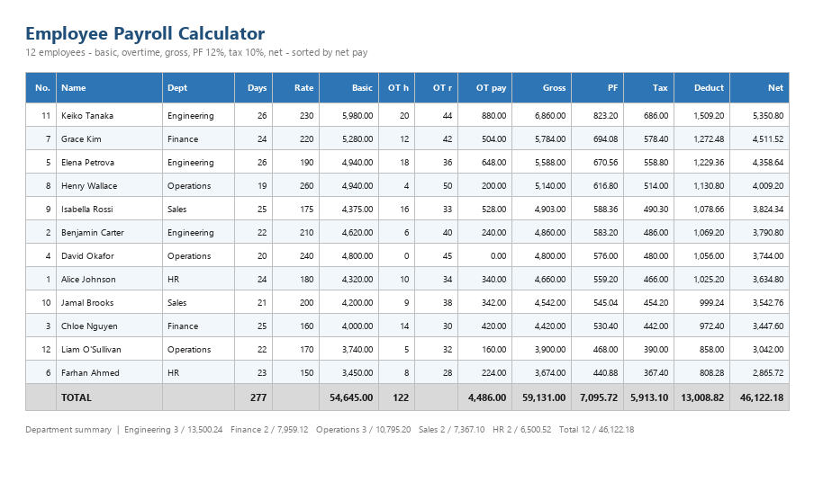

# Employee Payroll Calculator

**Practice exercise** — Excel



## Purpose

Calculate basic pay, overtime pay, gross pay, provident-fund deduction, tax and net pay for 12 employees, using named cells for the deduction rates, department grouping and formula self-auditing.

## Structure

| Sheet | Contents |
|---|---|
| `Payroll` | Calculations (rows 2–13), totals (row 14), department summary (B16:D23), integrity and rate checks (B25:C26) |
| `Lists` | Assumption rates and the department list |
| `README` | Documentation tab |

## Formulas

| Item | Calculation |
|---|---|
| Basic Pay | Days Worked × Daily Rate |
| Overtime Pay | Overtime Hours × Overtime Rate |
| Gross Pay | Basic Pay + Overtime Pay |
| PF Deduction | Gross Pay × PF_Rate |
| Tax | Gross Pay × Tax_Rate |
| Total Deductions | PF + Tax |
| Net Pay | Gross Pay − Total Deductions |

## Rates

`PF_Rate` = 12% and `Tax_Rate` = 10% are **named cells on the Lists sheet**. Change either and the whole workbook recalculates. The column headers update automatically because they are built with `TEXT()`:

```excel
="PF ("&TEXT(PF_Rate,"0%")&")"
```

## Result

- Net pay total: **46,122.18**
- Gross total: 59,131.00 · Total deductions: 13,008.82
- Top earners: Keiko Tanaka 5,350.80 · Grace Kim 4,511.52 · Elena Petrova 4,358.64

| Department | Headcount | Total Net |
|---|---:|---:|
| Engineering | 3 | 13,500.24 |
| Finance | 2 | 7,959.12 |
| Operations | 3 | 10,795.20 |
| Sales | 2 | 7,367.10 |
| HR | 2 | 6,500.52 |
| **Total** | **12** | **46,122.18** |

## Checks

| Check | Formula | Result |
|---|---|---|
| Integrity (C25) | `=IF(ABS(J14-M14-N14)<0.01,"OK","CHECK")` | OK |
| Rate check (C26) | `=IF(AND(ABS(K14-J14*PF_Rate)<0.01,ABS(L14-J14*Tax_Rate)<0.01),"OK","CHECK")` | OK |

The integrity check reconciles *gross total − deductions total = net total*. The rate check confirms the named rates were applied to every row.

## Note on formula auditing

The totals row originally computed PF as `=J14*PF_Rate` (total gross × rate) rather than `=SUM(K2:K13)`. Both produce the same figure while the rate is uniform, but the first would silently return a wrong total if the deduction ever became non-linear — for example a tax threshold or a contribution cap. It was changed to sum the column, and a reconciliation check was added so the totals row now proves itself.

## Skills demonstrated

Relative, absolute and mixed references · Named ranges · SUM / COUNTIF / SUMIF · `TEXT()` in header formulas · Sorting with live formulas · Conditional formatting · Charts · Formula auditing
